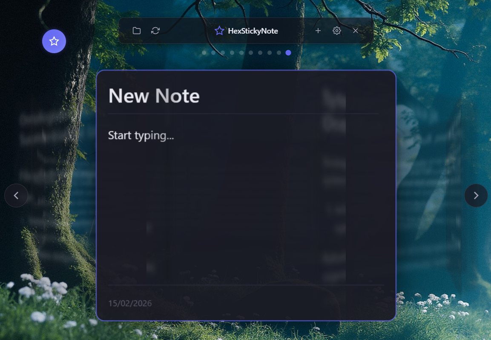

# HexStickyNote

A modern desktop note-taking application with AI integration and a unique 3D carousel interface. Create, edit, and enhance your notes using powerful AI models – all while keeping your data and API keys secure on your local machine.

> **Note:** Currently, this application is officially supported and tested on **Windows only**.



## Features

- **3D Carousel Interface**: Navigate your notes in an intuitive 3D carousel with smooth animations.
- **AI-Powered Writing**: Enhance your notes with AI assistance from multiple providers:
  - **Local LLM**: Run models like **Llama-Poro-2 8B Instruct** or **FIN Chat Summarization** completely offline.
  - **Cloud Providers**: OpenAI (GPT-4o), Anthropic (Claude 3.5 Sonnet), and Google Gemini.
- **GPU Acceleration**: Built-in support for **Vulkan** (Universal), **CUDA** (NVIDIA), and **ROCm** (AMD) to speed up local AI.
- **Finnish Language Support**: Optimized prompts and UI for Finnish users.
- **Markdown Editor**: Full-featured CodeMirror 6 editor with syntax highlighting and live preview.
- **Claude Desktop Integration**: Built-in **MCP (Model Context Protocol)** server that allows Claude Desktop to read and manage your notes.
- **Secure Storage**: API keys are stored in Windows Credential Locker (never in plaintext).
- **Portable Data**: Notes are stored as human-readable `.md` files with YAML metadata.

## Installation

### For Developers

#### Prerequisites
- [Node.js](https://nodejs.org/) (v18+)
- [Rust](https://rustup.rs/) (Stable)
- [Vulkan SDK](https://vulkan.lunarg.com/) (Optional, for GPU acceleration)

#### Setup
1. Clone the repository:
   ```bash
   git clone https://github.com/yourusername/HexStickyNote.git
   cd HexStickyNote
   ```
2. Install dependencies:
   ```bash
   npm install
   ```
3. Run in development mode:
   ```bash
   # Standard (CPU)
   npm run tauri dev

   # With GPU Acceleration (Vulkan)
   npm run dev:gpu
   ```

## Local AI & GPU Support

HexStickyNote supports running tekoäly (AI) locally on your computer.

### Recommended Models
- **Poro 2 8B Instruct**: Excellent for general writing and help in Finnish.
- **FIN Chat Summarization**: Lightweight model for summarizing Finnish text.

### GPU Acceleration
To use your graphics card for faster AI:
1. Ensure you have the **Vulkan SDK** or appropriate drivers installed.
2. Build or run the app with the GPU feature enabled:
   ```bash
   npm run dev:gpu
   ```
3. In the app, go to **Settings** -> **Local AI Models** and set **GPU Acceleration** to **Enabled**.
4. You will see a "Using GPU" indicator in the prompt bar when the AI is active.

## Claude Desktop (MCP)

HexStickyNote includes an MCP server. You can connect it to Claude Desktop to let Claude manage your notes:

1. Open **Settings** in HexStickyNote.
2. Scroll to **Claude Desktop**.
3. Click **Add to Claude Desktop**.
4. Restart Claude Desktop.

Claude can now use tools like `create_note`, `list_notes`, and `read_note` to help you manage your workspace.

## Data Storage

Notes are stored as Markdown files with YAML front matter in:
`%APPDATA%\HexStickyNote\HexStickyNote\cards\`

The filename automatically updates based on the first line (Heading) of your note.

Example format:
```markdown
---
id: "uuid-goes-here"
created_at: 1739621430
updated_at: 1739621430
---
# Muistiinpanon otsikko

Tämä on muistiinpanon sisältö...
```

## Build & Release

To create a production installer:
```bash
# Standard build
npm run tauri build

# Build with GPU (Vulkan) support
npm run build:gpu
```

## License
MIT - HexStickyNote

---
Made with ❤️ using Tauri, Svelte, and Rust.
