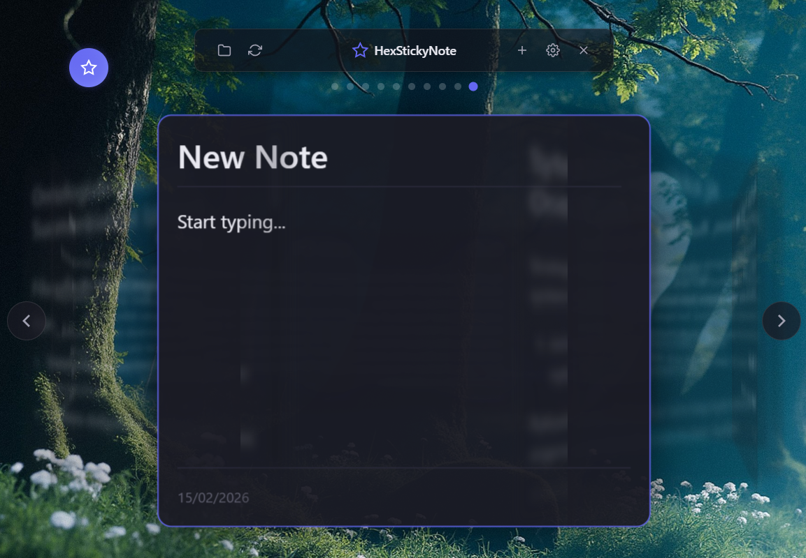

# HexStickyNote

A modern desktop note-taking application with local AI and a unique 3D carousel interface. Create, edit, and enhance your notes with AI models running on your own machine, or let Claude manage them through MCP – your notes stay on your computer.



## Features

- **3D Carousel Interface**: Navigate your notes in an intuitive 3D carousel with smooth animations.
- **Local AI Writing**: Download any model from the [Ollama library](https://ollama.com/library) (or a Hugging Face GGUF repo), or use the models already installed in your local **Ollama** – everything runs offline.
- **GPU Acceleration**: Built-in support for **Vulkan** (Universal), **CUDA** (NVIDIA), and **ROCm** (AMD) to speed up local AI.
- **Finnish Language Support**: Optimized prompts and UI for Finnish users.
- **Markdown Editor**: Full-featured CodeMirror 6 editor with syntax highlighting and live preview.
- **Claude Desktop Integration**: Built-in **MCP (Model Context Protocol)** server that allows Claude Desktop to read and manage your notes.
- **Portable Data**: Notes are stored as human-readable `.md` files with YAML metadata.

## Installation

### For Developers

#### Prerequisites
- [Node.js](https://nodejs.org/) (v18+)
- [Rust](https://rustup.rs/) (Stable)
- [Vulkan SDK](https://vulkan.lunarg.com/) (Optional, for GPU acceleration)
- [CMake](https://cmake.org/) and a C/C++ compiler (for building llama.cpp)

#### Linux
Install the Tauri system libraries, CMake and (optionally) Vulkan headers + `glslc`:
```bash
# Arch
sudo pacman -S --needed base-devel webkit2gtk-4.1 libayatana-appindicator librsvg openssl cmake clang \
  vulkan-headers vulkan-icd-loader shaderc

# Debian / Ubuntu
sudo apt install build-essential libwebkit2gtk-4.1-dev libayatana-appindicator3-dev librsvg2-dev \
  libssl-dev libxdo-dev cmake clang libvulkan-dev glslc
```

#### Setup
1. Clone the repository:
   ```bash
   git clone git@github.com:Carmantis/HexStickyNote.git
   cd HexStickyNote
   ```
2. Install dependencies:
   ```bash
   npm install
   ```
3. Run in development mode:
   ```bash
   # Standard (CPU)
   npm run tauri dev

   # With GPU Acceleration (Vulkan)
   npm run dev:gpu
   ```

## Local AI & GPU Support

HexStickyNote runs AI models locally on your computer. Open **Settings** -> **Local AI Models**:

- **Add model from the Ollama library**: type a model name such as `llama3.2:3b` or `qwen2.5:7b`
  (see [ollama.com/library](https://ollama.com/library)), or a Hugging Face GGUF repository such as
  `hf.co/user/repo:Q4_K_M`, and click **Download**. The model is stored in the app's data folder and
  runs on the built-in llama.cpp engine – Ollama does not need to be installed.
- **Model in use**: pick the model to write with. The list shows the models you have downloaded and,
  if [Ollama](https://ollama.com) is running, every model installed in it. Ollama models run through
  the local Ollama API (`OLLAMA_HOST` is respected).

For Finnish, [Poro 2](https://huggingface.co/LumiOpen) models work well, e.g.
`hf.co/mradermacher/Llama-Poro-2-8B-Instruct-GGUF:Q4_K_M`.

### GPU Acceleration
To use your graphics card for downloaded models (Ollama manages its own GPU use):
1. Ensure you have the **Vulkan SDK** or appropriate drivers installed.
2. Build or run the app with the GPU feature enabled:
   ```bash
   npm run dev:gpu
   ```
3. In the app, go to **Settings** -> **Local AI Models** and set **GPU Acceleration** to **Enabled**.
4. You will see a "Using GPU" indicator in the prompt bar when the AI is active.

## Claude Desktop (MCP)

HexStickyNote includes an MCP server. You can connect it to Claude Desktop to let Claude manage your notes:

1. Open **Settings** in HexStickyNote.
2. Scroll to **Claude Desktop**.
3. Click **Add to Claude Desktop**.
4. Restart Claude Desktop.

Claude can now use tools like `create_note`, `list_notes`, and `read_note` to help you manage your workspace.

**Tip**: When Claude creates or modifies notes, click the refresh button (🔄) in HexStickyNote to see the changes immediately.


## Build & Release

To create a production installer:
```bash
# Standard build
npm run tauri build

# Build with GPU (Vulkan) support
npm run build:gpu
```

Installers are written to `src-tauri/target/release/bundle/` (`.msi`/`.exe` on Windows,
`.deb`/`.rpm` on Linux).

### Arch Linux

`packaging/arch/PKGBUILD` turns the `.deb` build into a pacman package:
```bash
npm run build:gpu -- --bundles deb   # or: npm run tauri build -- --bundles deb
cd packaging/arch
makepkg -si
```
After installing, open **Settings** -> **Claude Desktop** once and click **Add to Claude Desktop**
so Claude uses the installed MCP server path.

## License
MIT - HexStickyNote

---
